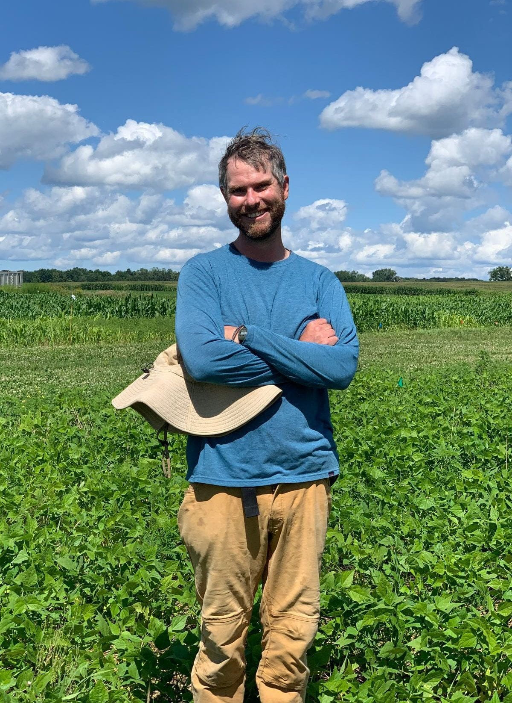

```{r setup, include=FALSE}
knitr::opts_chunk$set(echo = TRUE)
```

# Organic Field Crops Research

Hi! We are [Natasha Djuric](https://github.com/natashadjuric-4) & [Eric Youngerman](https://github.com/ericyoungerman) and we are two graduate students in the Sustainable Cropping Systems Lab.
<br>


{width="150px"} 

<br>

{width="150px"}


<br>


