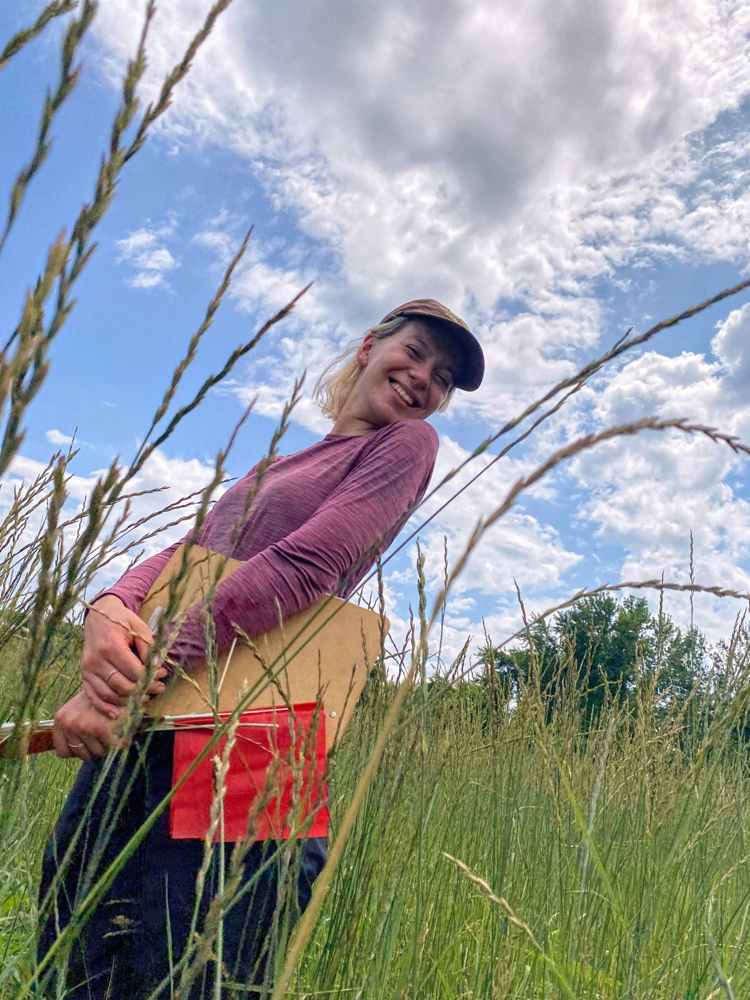
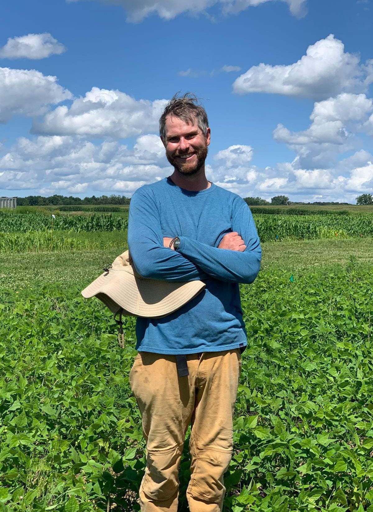

index
================

# Organic Field Crops Research

Hi! We are [Natasha Djuric](https://github.com/natashadjuric-4) & [Eric
Youngerman](https://github.com/ericyoungerman) and we are two graduate
students in the Sustainable Cropping Systems Lab.  

<figure>

<figcaption aria-hidden="true">Natasha examining her first year stand of
Kernza</figcaption>
</figure>

 

<figure>

<figcaption aria-hidden="true">Eric basking in some organic no-till
soybean</figcaption>
</figure>

 
